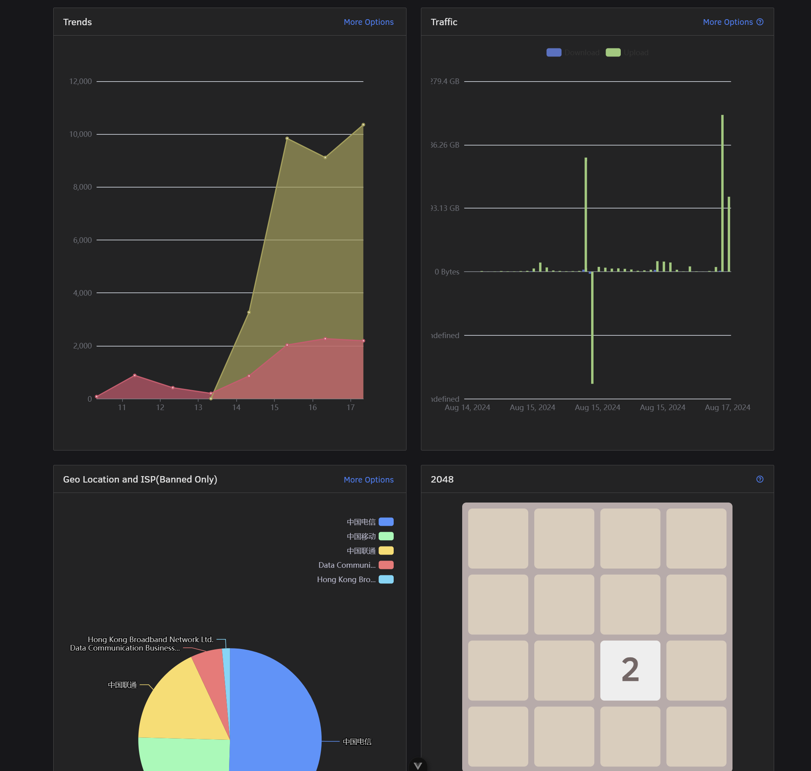

vue-2048
==========

This is a implement of 2048 in Vue 3.0, typescript. Basically a copy from https://github.com/pengfu/vue-2048, and convert it to typescript.

You can use it in your vue project if you have a blank area and don't know what to fill it.
# Example


# Usage
```bash
npm i vue-2048
```
```html
<template>
 <vue2048 style="margin: 0 auto" />
</template>
<script lang="ts" setup>
import vue2048 from 'vue-2048'
</script>
```

### Install the dependencies

```bash
yarn
```

### Run the dev server with hot reload at localhost:3000

```bash
yarn dev
```

### Build the app for production

```bash
yarn build
```

